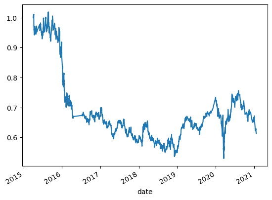
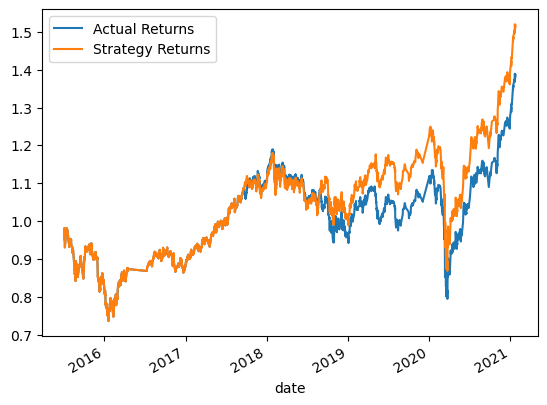
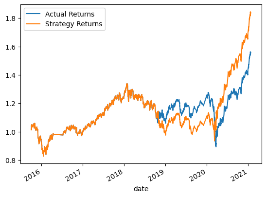
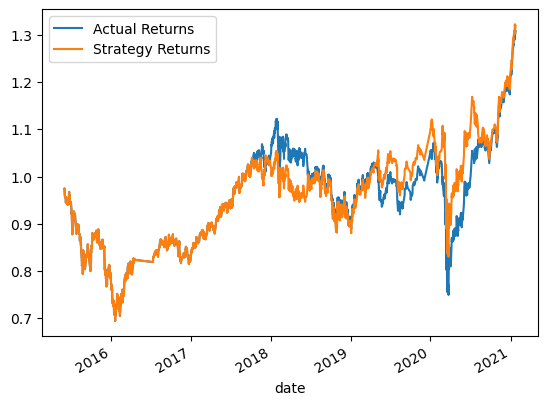
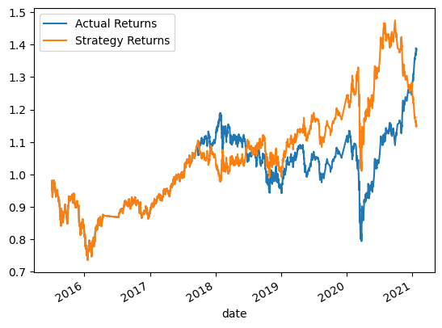

# Machine Learning Trading Bot

## Analysis 

This strategy involved buying when the closing prices increased (i.e., daily return was positive), selling when the closing prices decreased (i.e., daily return was negative), and holding when there was no change in the closing price.

Overall, the cumulative return showed a negative trend, which is not promising.

Interestingly, the strategy performs better if you do the opposite: sell when closing prices increase and buy when they decrease.

## Support Vector Machine - Baseline
We now explore the Support Vector Machine (SVM) using the Fast (4-day) and Slow (100-day) moving averages as our baseline strategy. We separate the data into dates and moving averages, split these into training and testing sets based on date, scale the moving averages, and train the SVM model. The training period was from April 2, 2015, to July 2, 2015, and the testing period from July 6, 2015, to January 21, 2021. After training the model, we apply it to the testing data to generate buy and sell indicators.

Comparing the SVM model to actual returns, the model closely followed the actual returns. However, the classification report indicates that the model performed poorly in predicting buy and sell signals, with low F1 scores reflecting low confidence in the model.

              precision    recall  f1-score   support

        -1.0       0.43      0.04      0.07      1804
         1.0       0.56      0.96      0.71      2288

    accuracy                            0.55      4092
    macro avg       0.49      0.50      0.39      4092
    weighted avg    0.50      0.55      0.43      4092

## First Tuning
The first tuning involved using the original data but increasing the training period from 3 months to 6 months, resulting in the following classification report:

              precision    recall  f1-score   support

        -1.0       0.44      0.33      0.38      1804
         1.0       0.56      0.66      0.61      2288

    accuracy                            0.52      4092
    macro avg       0.50      0.50      0.49      4092
    weighted avg    0.51      0.52      0.51      4092

With 6 months of training data, cumulative returns were approximately 1.8, compared to 1.5 with 3 months of training data. Although returns were lower in 2019/2020, they more than recovered in 2021.

## Second Tuning
For the second tuning, we used a 4-day short moving average and a 50-day long moving average, reverting to the original 3-month training period. This yielded the following classification report:

              precision    recall  f1-score   support

        -1.0       0.42      0.13      0.19      1826
         1.0       0.56      0.86      0.68      2321

    accuracy                            0.54      4147
    macro avg       0.49      0.49      0.43      4147
    weighted avg    0.50      0.54      0.46      4147

This strategy was not effective, with performance declining and only slightly outperforming actual returns in 2021.

## Logistic Regression
Logistic regression produced the following classification report:

              precision    recall  f1-score   support

        -1.0       0.44      0.33      0.38      1804
         1.0       0.56      0.66      0.61      2288

    accuracy                           0.52      4092
    macro avg       0.50      0.50     0.49      4092
    weighted avg    0.51      0.52     0.51      4092

This was the worst strategy, with cumulative returns falling below actual returns. It also had lower accuracy, recall, and F1 scores compared to other reports.

## Conclusion
The best result came from extending the training data from 3 months to 6 months, showing cumulative returns of over 1.8. The second tuning, which shortened the long moving average from 100 to 50 days, provided worse statistics, with a weighted average F1 score of 0.46 compared to 0.51 from the first tuning. None of the models were particularly impressive, and further refinement is needed. Future models should use at least 6 months of training data.

